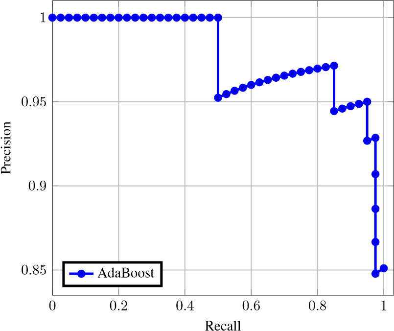
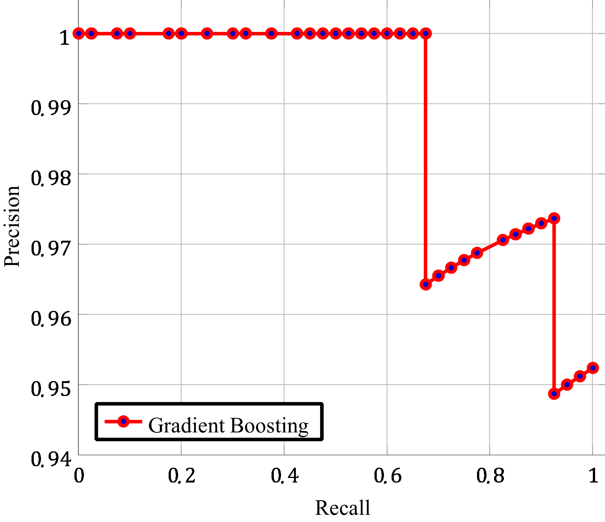
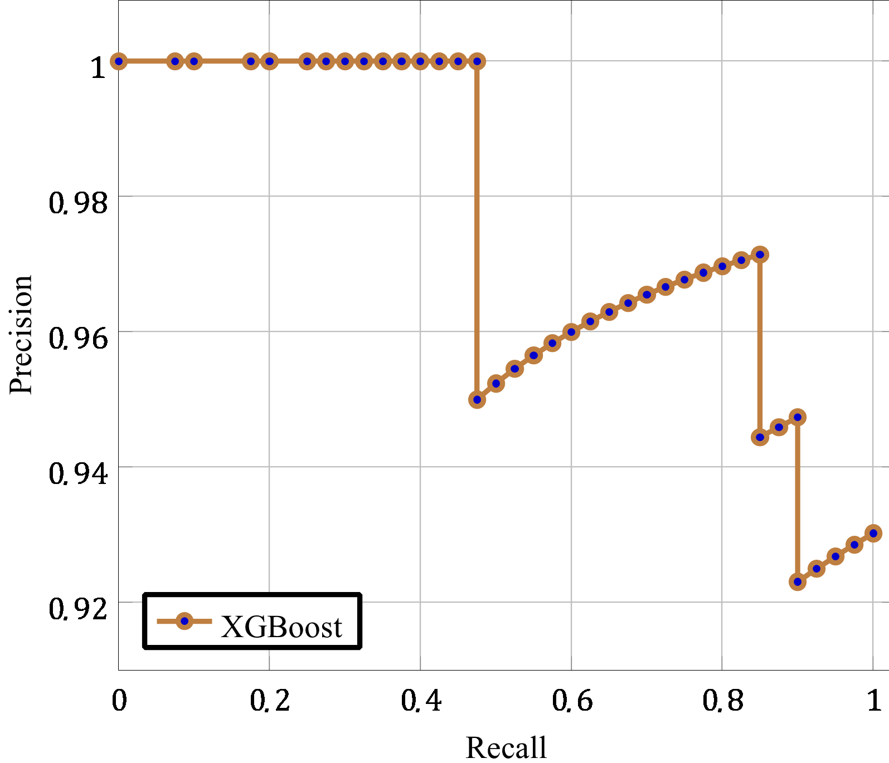
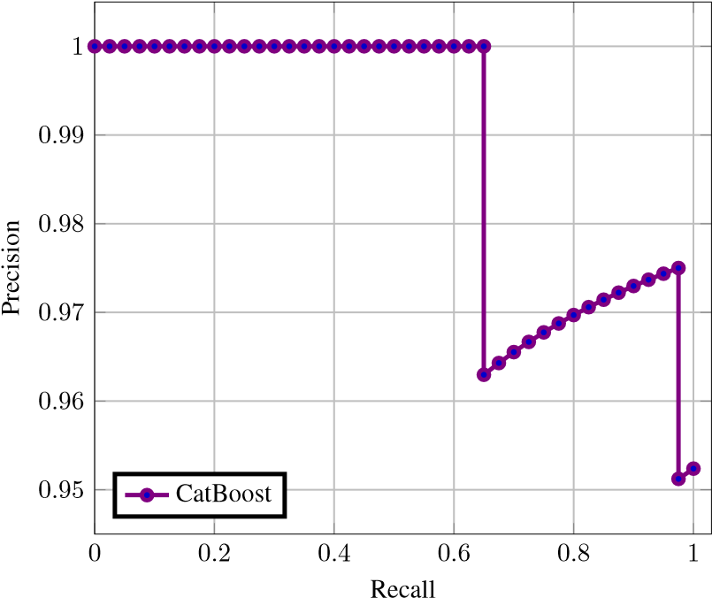
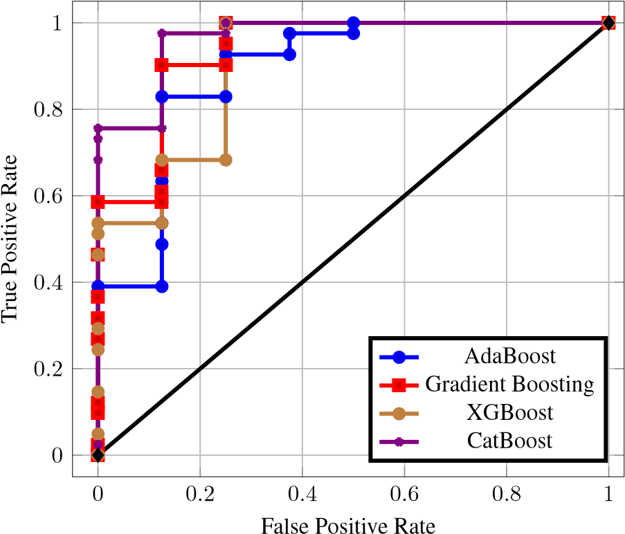

# Succinct-differentiation-of-disparate-boosting-ensemble-learning-methods-for-prognostication-of-PCOS

This repository is the implementation of [Succinct Differentiation of Disparate Boosting Ensemble Learning Methods for Prognostication of Polycystic Ovary Syndrome Diagnosis](https://ieeexplore.ieee.org/abstract/document/9697163). If you use this repo or paper, please consider citing it.

The dataset used can be found [here](https://www.kaggle.com/datasets/prasoonkottarathil/polycystic-ovary-syndrome-pcos).

## Citation:

```
@inproceedings{gupta2021succinct,
  title={Succinct differentiation of disparate boosting ensemble learning methods for prognostication of polycystic ovary syndrome diagnosis},
  author={Gupta, Abhishek M and Shetty, Sannidhi S and Joshi, Raunak M and Laban, Ronald Melwin},
  booktitle={2021 International Conference on Advances in Computing, Communication, and Control (ICAC3)},
  pages={1--5},
  year={2021},
  organization={IEEE}
}
```


Prognostication of medical problems using the clinical data by leveraging the Machine Learning techniques with stellar precision is one of the most important real world challenges at the present time. Considering the medical problem of Polycystic Ovary Syndrome also known as PCOS is an emerging problem in women aged from 15 to 49. Diagnosing this disorder by using various Boosting Ensemble Methods is something we have presented in this paper. A detailed and compendious differentiation between Adaptive Boost, Gradient Boosting Machine, XGBoost and CatBoost with their respective performance metrics highlighting the hidden anomalies in the data and its effects on the result is something we have presented in this paper. Metrics like Confusion Matrix, Precision, Recall, F1 Score, FPR, RoC Curve and AUC have been used in this paper.

## Keywords 
* Ensemble Learning
* Boosting Ensemble Methods
* AdaBoost
* GBM
* XGBoost
* CatBoost

## Results
* Table 1: Comparison of Various Boosting Techniques Used

| Algorithm | Training | Testing |
| :---         |     :---:      |          ---: |
| AdaBoost   | 96.49%     | 85.71%    |
| Gradient Boosting     | 88.6%       | 79.59%      |
| XGBoost     | 95.61%      | 85.71%      |
| CatBoost     | 99.98%      | 95.92%      |

* Confusion Matrix

| Algorithm | Precision | Recall | F-Score |
| :---         |     :---:      |          ---: |         ---: |
| AdaBoost | 0.9069 | 0.975 | 0.9397 |
| Gradient Boosting | 0.8695 | 0.944 | 0.9302 |
| XGBoost | 0.9090  | 0.944 | 0.9523 |
| CatBoost | 0.9523 | 1.0 | 0.9756 |

* Precision Recall

Precision Recall Curve is used mostly when there is large imbalance in dataset and we want to practically harness our problem to find which is the best choice for Boosting Algorithm since relying on a single metric is definitely detrimental and not a proper measure of selecting the algorithm.



                                          Figure 1: Precision Recall Curve for AdaBoost



                                                    Figure 2: Precision Recall Curve for GBM




                                                    Figure 3: Precision Recall Curve for XGBoost




                                           Figure 4: Precision Recall Curve for Cat Boost


* RoC and AUC Curve

RoC Curve is known as Receiver Operator Characteristic Curve which is used for performance measurement for classification models. It gives detailed probability fluctuations throughout the predictions indicating the classes. This is calculated on the basis of 2 pillars known as True Positive Rate (TPR) and False Positive Rate (FPR). TPR is also known as Sensitivity and works much similar to Recall.




                                                     Figure 5: RoC and AUC


